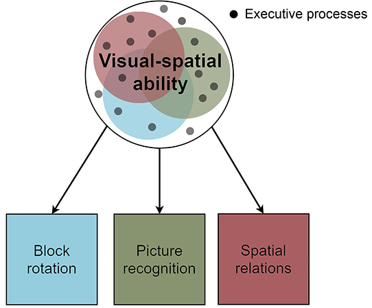
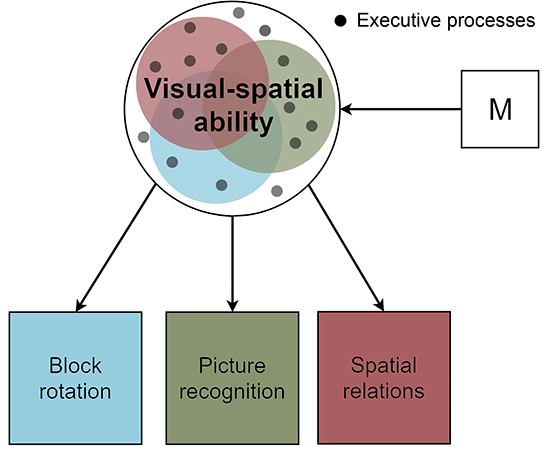
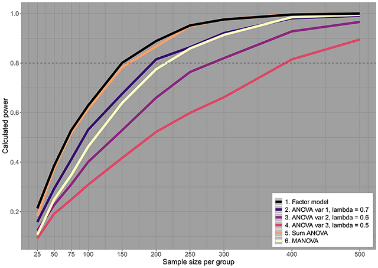

```{r setup, include=FALSE}
#packages <- c("tiff","grid")
options(scipen=999)
#lapply(packages,library,character.only=T)
knitr::opts_chunk$set(dpi=600, fig.pos = 'H', message = FALSE) 
devtools::session_info()
```
\setlength\parindent{34pt}

\vspace{30pt}

\centerline{Accepted manuscript}
\centerline{Published in Journal of Applied Research in Memory and Cognition}
\centerline{https://doi.org/10.1016/j.jarmac.2019.06.007}

\vspace{40pt}

\noindent Corresponding author 

Esther Maassen

Tilburg University, Warandelaan 2, 5037 AB, Tilburg, the Netherlands

emaassen@protonmail.com

\vspace{20pt}
\noindent Author Contributions

EM conducted the statistical analyses. EM and JMW both contributed to the writing of the manuscript. 

\vspace{20pt}
\noindent Acknowledgments

The preparation of this work was supported by a Consolidator grant (IMPROVE) from the European Research Council (ERC grant no. 726361).

\newpage
\setlength{\leftskip}{0cm}

\noindent In their thought-provoking paper, @kovacs2019 argue in favor of the use of latent variable modelling as a way to connect experimental methods to differential research of human intelligence and its lower order cognitive factors. According to Kovacs and Conway’s Process Overlap Theory (POT), different ability processes overlap with one another, meaning that cognitive tasks are tapped by both domain-specific and domain-general abilities. For instance, a spatial relations task taps both the underlying specific visual-spatial ability and general executive processes. Our aim is to expand on the benefits of a latent variable approach as discussed by Kovacs and Conway and to argue that latent variable modelling can be used in distinguishing domain-specific from domain-general processes in applied or more theoretical research on cognition. To illustrate, we will use a model-based approach to study individual differences within groups, which can be readily extended to compare groups in experimental or quasi-experimental designs, considering one of the lower-order factors of intelligence as identified in the Cattell-Horn-Carroll hierarchy of human intelligence differences [@mcgrew2009]. We will point at the essential requirement of measurement invariance and will present simulation results showing the statistical benefits of using the latent variable approach over traditional analytic approaches used in experimental and applied research into cognition.

Figure 1 depicts the lower-order factor visual-spatial thinking, or Gv, as measured by three indicators or subtests: block rotation, picture recognition, and spatial relations. The factor reflects partially overlapping processes, including domain-general executive processes. To explain the benefits of the latent variable approach, we envision a randomized experiment involving two groups of 10-to-12-year-old children. In the treatment group, the children will play Fortnite, an online shooting game with strong visual-spatial demands, three hours each day for two months. In the control group, children will watch television for the same amount of time. Afterwards, both groups will perform the three subtests related to visual-spatial thinking, and the mean differences between the groups will be compared.

```{r fig1, echo=FALSE, fig.align='center', fig.cap="One-factor model (visual-spatial ability) with three indicator variables (block rotation, picture recognition, and spatial relations). Figure adapted from Kovacs and Conway (2016).", out.width = '50%'}

```

Differences between groups of subjects are traditionally investigated using statistical analyses such as (multivariate) analysis of variance ((M)ANOVA), which compare the between-group variance of observed variables (mean differences) to the variance within groups. However, ANOVA methods are based on unrealistic and restrictive assumptions, as mentioned by Kovacs and Conway and others (e.g., @wicherts2005). ANOVA methods assume absence of measurement error of observed variables, and cannot evaluate whether the construct that is measured by the test scores is measured similarly in the different (experimental) groups. Moreover, ANOVA methods assign equal importance to all variables of interest, and run the risk of increased Type I and Type II error rates. Kovacs and Conway thus rightly advocate for using a latent variable approach.

If we assume there is a latent variable, or factor, underlying the three subtests, namely visual-spatial ability, we assume a measurement model (as depicted in Figure 1), that relates the scores on the three subtests to the factor. In this model the test scores are regressed on the factor Gv, yielding the measurement parameters for each of the subtests: an intercept, a regression weight or factor loading, and a residual variance parameter reflecting both unique systematic variance and random measurement error (see formula 2 in Kovacs and Conway, 2019). The measurement model allows us to summarize the three subtests by estimating the difference in factor means (and factor variances), on which the groups can be compared. Under one (ideal) scenario, where there is measurement invariance as implied by group-invariant measurement parameters (factor loadings, intercepts, and possibly also residual variances), this method offers a parsimonious model that represents the idea that all experimental effects (here: group differences based on randomization) are fully mediated by the global latent factor. This lowers the chances of Type I errors that apply under the use of separate ANOVAs. Under measurement invariance, the power of the test of factor mean differences in the latent variable model is also higher than the power of ANOVAs applied to either the three indicators, or (in most real-life scenarios) on the (unweighted) sum score of the three (standardized) indicators.

```{r fig2, echo=FALSE, fig.align='center', fig.cap="One-factor model with three indicator variables and Fortnite manipulation effect (M).", out.width = '50%'}

```

Full mediation of the experimental effect by a latent factor requires that the factor scores can be meaningfully compared across (experimental) groups, which is met when the factor loadings and intercepts are invariant over the groups (a condition called factorial invariance by @meredith1993). In theory, the model also offers an interesting option to distinguish specific from general effects (or differences or associations) as long as these specific effects are limited to one of the indicators. Suppose we expect the manipulation (illustrated by *M* in Figure 2) of playing Fortnite to improve children's visual-spatial abilities (a general effect). If the manipulation affects only factor Gv, we expect a factor mean difference on Gv between the control and treatment groups. In this case, the observed mean differences between the control and treatment group on the three subtests can be explained fully by group differences on the latent factor. More technically, if these observed mean differences on the subtests are solely due to a difference in the factor visual-spatial ability, the relative size of the three observed mean differences should be collinear with the relative size of the factor loadings [@wicherts2010]. 

Because we can estimate the factor loadings *within* the two experimental groups – and check whether these factor loadings are invariant – we can also see whether the *between group mean differences* align with the hypothesis that the factor can fully explain the experimental effect. Indicators with a high loading should also show a relatively large mean effect, while weakly loaded indicators should show relatively smaller effects if indeed the experimental effect is fully mediated by the factor (a general latent effect).

This is an ideal situation, since the factor mean difference and subtest mean differences between the groups can be explained fully by the manipulation of playing Fortnite. We are then able to state that there is measurement invariance, and that given a certain visual-spatial ability, the expected score on any of the three subtests is independent of whether children were placed in the control or treatment group. As a result, the groups can be meaningfully compared on their mean visual-spatial ability score [@meredith1993;@lubke2003] and the experimental effect can be safely interpreted (both theoretically and practically) in terms of a domain-general effect. 

```{r fig3, echo=FALSE, fig.align='center', fig.cap="One-factor model with three indicator variables, Fortnite manipulation effect (M), and spatial relations showing uniform bias (dotted arrow).", out.width = '50%'}

```

However, a latent variable approach also allows us to check whether we are dealing with other scenarios, such as when there is partial factorial invariance because one of the indicators is affected by the treatment directly. For instance, the Fortnite manipulation could have an additional specific effect on one of the three tests in addition to having an effect on the Gv factor, as illustrated by the added direct effect to the spatial relations subtest in Figure 3. In this case, the mean latent Gv factor cannot fully explain the group differences on the spatial relations test; there is measurement non-invariance. We then also expect the regression equation to be different for both groups because of differences in the measurement intercept [@wicherts2005]. More specifically, if we expect the overestimation on the spatial relations subtest for the treatment group to be equal for all ability levels (a uniform effect), we would expect this to show up as an intercept difference between the groups (i.e., uniform bias) on the subtest of spatial relations [@wicherts2005]. The multi-group factor model can also be used to study non-uniform bias that emerges as between-group differences in factor loadings. Note that these differences can be the result of interactions or non-linear effects (see @wicherts2005). In line with much applied experimental research, we focus here on mean effects and assume invariance of the loadings (which is a testable assumption associated with less powerful tests as those presented below).

If we are concerned with understanding how latent constructs and observed variables relate to one another, using a factor model and finding measurement non-invariance can be very informative, and is not necessarily problematic. It can for instance highlight the importance of additional covariates that were previously not modelled. If the Fortnite manipulation has an effect on the spatial relations subtest beyond the manipulation effect mediated by the visual-spatial ability factor (Figure 3), it could be that the Fortnite manipulation invokes more executive processes. These processes then tap more into the spatial relations subtest than in the control group, and the visual-spatial ability factor thus is differently constructed in both groups. Another possibility is that the Fortnite manipulation has a direct effect on the spatial relations subtest, but the visual-spatial ability factor taps only the block rotation and picture recognition subtests. Regardless, using a measurement model has the applied benefit of being able to check whether groups can be compared, as well as the theoretical and practically interesting benefit of being able to differentiate between domain-specific and domain-general abilities related to cognitive or other latent factors. 

\centerline{\textbf{Minimal requirements under Measurement Invariance}}
In sum, a latent variable approach is often preferable over traditional ANOVA methods used in applied research because it offers much more information on the measurement model and practically and theoretically useful indications of whether the treatment (or associations) is general and/or specific. Unfortunately, it is not always feasible to employ a latent variable model. It is often been heard that they require very large sample sizes, but models with a small number of indicators (and the between-group restrictions implied under measurement invariance) are relatively parsimonious and might be suitable for smaller samples that are common in (applied) experimental research. We carried out a simulation study[^1] in which we compared the performance of a one-factor model with three indicators to traditional models (i.e., using separate ANOVAs per indicator, using a sum score for the three indicators before testing with ANOVA, and using a multivariate (M)ANOVA model). Our aim was to find out whether the one-factor model would be able to accurately retrieve our simulated factor mean difference between two groups, and to what extent the factor model outperforms traditional methods with regard to statistical power in small samples. Additionally, we checked Type I error rates, convergence for the factor model, CFI and RMSEA estimates, and accurate factor loading retrieval. We first simulated under measurement invariance, meaning the parameters of the measurement model were the same for both groups, and we also consider uniform bias after. We varied factor loadings, sample size, and factor mean difference between groups. Next, we will discuss the feasibility of using a latent variable model instead of traditional ANOVA methods, when the sample sizes per group are small (*N* = 50 to *N* = 100), and the expected effect size is small to moderate (Cohen’s *d* = 0.4). These estimates coincide with the median sample size (*N* = 60) and median weighted effect size (*r* = 0.26) found in approximately 2400 effect sizes in 131 meta-analyses in intelligence research [@nuijten2018].

Our simulation results show that when an effect size of *d* = 0.4 is expected and the sample size per group is *N* = 50, at least moderate correlations (*r* > 0.35) across the observed variables are needed to achieve accurate estimations in a factor model. Note that these correlations are free of measurement error and therefore assume perfect reliability of the test scores. If test scores show lower reliability, the observed correlations need to be larger. If these conditions are satisfied, the statistical power of the factor model will be larger than traditional ANOVA methods for estimation. 

Statistical power is a function of multiple factors. As sample size increases, so does power. This entails that if the sample size per group increases from *N* = 50 to *N* = 100 and the effect size remains the same (*d* = 0.40), the correlation between the observed variables can be smaller (*r* $>$ 0.25) and the factor model still outperforms ANOVA methods. If the effect size increases (*d* = 0.60) and the correlation between the observed variables remains the same (*r* $>$ 0.25), the sample size per group is allowed to be smaller (*N* $>$ 75). Conversely, if the observed variables are more strongly correlated (*r* $>$ 0.40), using a factor model will still be feasible with a small sample size (*N* = 50) and small effect size (*d* = 0.20). Moreover, when the number of observed variables per factor increases, the model can also be more lenient regarding effect sizes, sample sizes, or correlations among observed variables, while still retaining statistical power. To illustrate the extent to which factor models outperform ANOVA methods, Figure 4 displays the statistical power to find a mean difference of the factor model and the ANOVA methods in a situation where the effect size is *d* = 0.4, and the average correlation among variables is *r* = 0.36.

```{r fig4, echo=FALSE, fig.align='center', fig.cap="Statistical power to find a mean difference of the one-factor three-indicator model and ANOVA methods with an effect size of d = 0.4 and an average correlation between observed variables of r = 0.36. The dashed line indicates statistical power of 0.80.", out.width = '97%'}

```

\centerline{\textbf{Detecting Indicator-specific Effects (or Uniform Bias)}}
In addition to our first simulation study, we checked the performance of a one-factor three-indicator model under uniform bias of one variable, i.e., when there is an additional effect from the manipulation on the third subtest, as in Figure 3. Our main goal was to find out which conditions are necessary to be able to accurately estimate a factor mean difference between groups in the presence of intercept bias.

Results show that when only one variable shows measurement non-invariance in the intercepts, the singular ANOVA for that variable, as well as the sum score ANOVA and MANOVA method substantially overestimate the mean difference between groups. Conversely, the factor model is capable of handling non-invariance in one variable and estimating accurate factor means, regardless of the amount of uniform bias. However, the aforementioned necessary requirements need to be upheld. This entails that when an effect size of *d* = 0.4 is expected and the sample size per group is *N* = 50, moderate correlations (r $>$ 0.35) across the observed variables are necessary. The same trade-off between effect size, sample size, and observed correlations as before apply. 
 
Finally, even when the amount of bias is relatively small, and the expected factor mean difference is small (*d* = 0.2 or *d* = 0.4), power to detect uniform bias in one variable is larger than 0.80 if the model either has small correlations among observed variables (*r* = 0.25) and a large sample size per group (*N* = 200), or larger correlations (*r* = 0.49) and a smaller sample size per group (*N* = 100). 

We advise researchers who are interested in using a factor model to compare groups to first perform the necessary check of measurement invariance (for more information on testing measurement invariance, see @putnick2016a). If the model shows uniform bias in one variable, the biased parameter should be released from the group equality constraint and be freely estimated. The model should then be checked for partial measurement invariance. If partial measurement invariance holds and the data meet the previously mentioned requirements, the factor model is able to accurately estimate mean differences per group. 

Using a factor model lends itself to intelligence research since cognitive tests are generally well-validated and highly correlated (e.g., @matzke2010, @canivez2017), which make them particularly suitable when comparing groups in (quasi-)experimental designs. We note that identifying factor mean differences is more complex when multiple variables are uniformly biased or when there is non-uniform bias as reflected in group differences in factor loadings. Ideally, researchers should formulate specific hypotheses on the type of (uniform) bias and effects they expect when studying more general (latent) effects and specific effects in cognition research (e.g., see @wicherts2005 for such specific hypotheses). By highlighting the benefits of a factor model approach we hope to further research on cognitive abilities, as well as to have aided Kovacs and Conway in showing the value of a unified formal modelling approach for experimental psychology and differential research.


[^1]: More information on the complete simulation study can be found at https://osf.io/9vp36/.

\newpage
\centerline{References}
\setlength{\parindent}{-0.2in}
\setlength{\leftskip}{0.2in}
\setlength{\parskip}{8pt}
\noindent